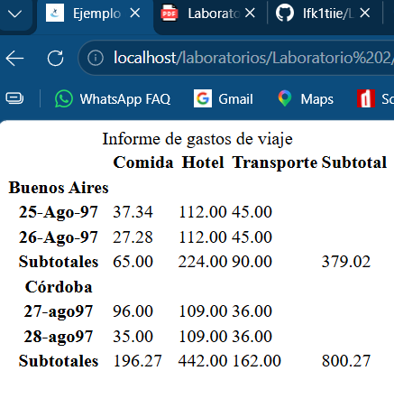
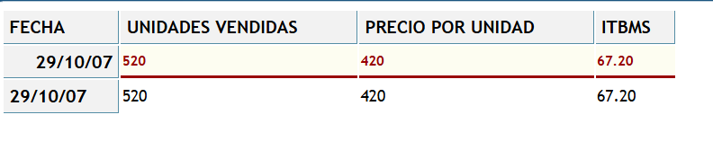
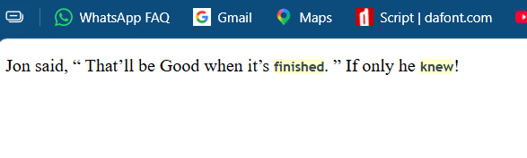
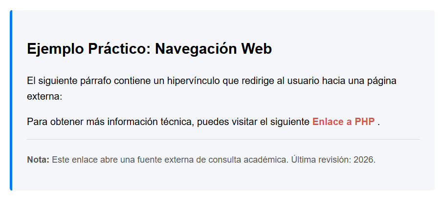
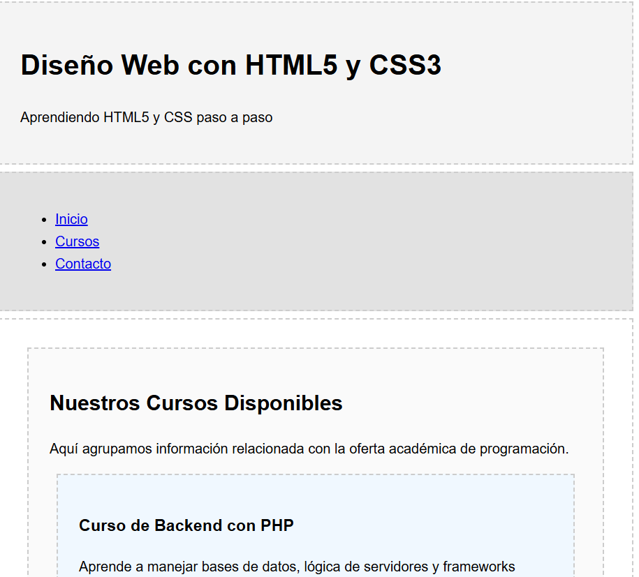

# Laboratorio #2 - HTML5

**Fecha:** [11/09/2026]

## Contenido del Repositorio

Este repositorio contiene los ejercicios realizados durante el Laboratorio #2 de HTML5 y CSS.

Durante la práctica se realizaron diferentes ejercicios relacionados con tablas, enlaces, clases, identificadores, selectores CSS y etiquetas semánticas de HTML5.

## Tecnologías Utilizadas

- HTML5
- CSS3
- Visual Studio Code
- WampServer
- GitHub

## Capturas de Pantalla y Problemas

### Tabla #1 - Informe de gastos de viaje

La Tabla #1 consiste en la creación de una tabla HTML para representar un informe de gastos de viaje.



### Tabla #2

La Tabla #2 utiliza elementos `<th>` y `<td>` para organizar la información y estilos CSS para modificar su apariencia.



### Ejemplo #3

En este ejemplo se trabajó con etiquetas HTML y selectores CSS.



### Ejemplo #4

En este ejemplo se trabajó con clases, identificadores y un enlace externo.



### Ejemplo #5

En este ejemplo se trabajó con las etiquetas semánticas de HTML5.



## Estructura de Carpetas o Directorios

```text
laboratorio2/
├── ejemplo3.html
├── ejemplo3.png
├── ejemplo4.html
├── ejemplo4.png
├── ejemplo5.html
├── ejemplo5.png
├── estilosparrafos.css
├── estilostabla.css
├── tabla1.html
├── tabla1.png
├── tabla2.png
├── tablas2.html
└── README.md
